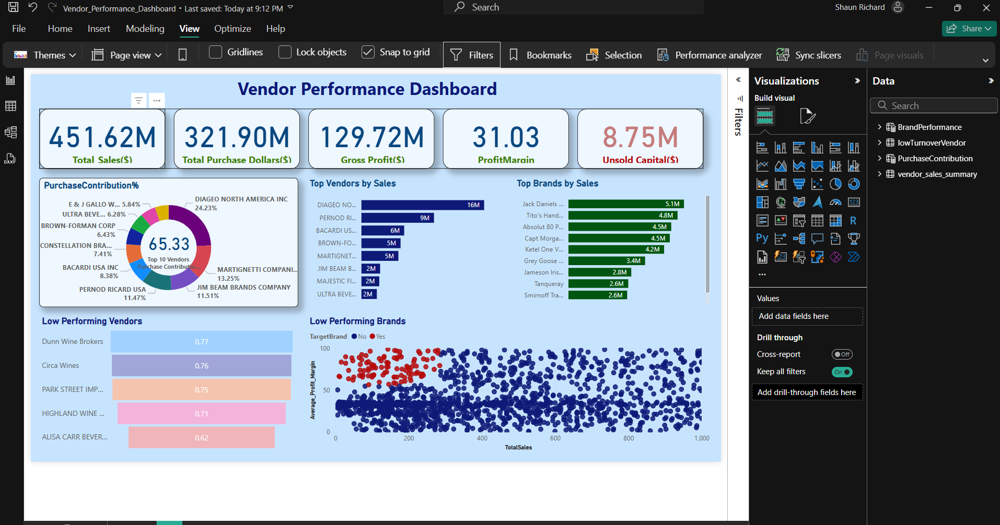

# 📦 Vendor Performance Analysis

This project analyzes vendor performance using *SQL, **Python, and **Power BI*, covering the full data workflow from ingestion to reporting. The goal is to uncover actionable insights related to cost efficiency, vendor reliability, and inventory turnover.

---

## 🧰 Tools & Technologies
- *SQL* – Data extraction and filtering  
- *Python (Jupyter Notebooks)* – Data cleaning, EDA, statistical analysis  
- *Power BI* – Interactive dashboard for visual insights  

---

## 📁 Project Files

| File | Description |
|------|-------------|
| [01_Data_Ingestion.ipynb](./01_Data_Ingestion.ipynb) | Initial data loading and preprocessing |
| [02_EDA.ipynb](./02_EDA.ipynb) | Exploratory Data Analysis with charts and summaries |
| [03_Vendor Performance Analysis.ipynb](./03_Vendor%20Performance%20Analysis.ipynb) | Final analysis and insights using statistical methods |
| [04_Dashboard_Preview.PNG](./04_Dashboard_Preview.PNG) | Screenshot of the Power BI dashboard |
| [05_Vendor_Performance_Dashboard.pbix](./05_Vendor_Performance_Dashboard.pbix) | Full interactive Power BI dashboard file |
| [06_Final_Report.pdf](./06_Final_Report.pdf) | Final business report with insights and recommendations |

---

## 📊 Dashboard Preview

---

## 🔍 Key Insights
- *Top 10 vendors* contribute over 65% of total purchases — risk of over-dependence
- *198 brands* show high profit margins but low sales — marketing opportunity
- *Bulk purchasing* reduces cost per unit by 72%
- ₹2.71M worth of *unsold inventory* — needs better inventory control

---

## 📄 Read the Final Report
📎 [Download PDF Report](./06_Final_Report.pdf)

---

## 👤 About Me
Hi, I'm *Shaun Richard*, a data analyst passionate about turning raw data into business insights using Python, SQL, and BI tools.

📧 shaunrichard1007@email.com  
🔗 [LinkedIn]www.linkedin.com/in/shaun-richard-b79a38288
